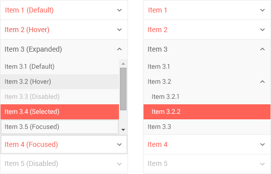

# PanelBar Overview

The PanelBar displays hierarchical data as a multi-level, expandable component. To store its state and configuration options, use a high-order component.

It is part of the [kendo-react-layout npm package](https://www.npmjs.com/package/@telerik/kendo-react-layout).

**Figure 1: A template of the PanelBar**



## Demos

### Default Setup

```html-preview
<div id="app"></div>
<style>
    .k-panelbar {
        max-width: 400px;
        margin: 0 auto;
    }
    .teamMate:after {
        content: ".";
        display: block;
        height: 0;
        line-height: 0;
        clear: both;
        visibility: hidden;
    }
    .teamMate h2 {
        font-size: 1.4em;
        font-weight: normal;
        padding-top: 20px;
    }
    .teamMate p {
        margin: 0;
    }
    .teamMate img {
        float: left;
        margin: 5px 15px 5px 5px;
        border: 1px solid #ccc;
        border-radius: 50%;
    }
</style>
```
```jsx
    const { PanelBar, PanelBarItem, PanelBarContent } = KendoReactLayout;
    class PanbelBarContainer extends React.Component {
        constructor(props) {
            super(props);
            this.state = {
                selected: "0"
            };
        }
        onSelect = (e) => {
            this.setState({
                selected: e.id
            });
        };

        render() {
            const selected = this.state.selected;

            return (
              <PanelBar onSelect={this.onSelect}>
                <PanelBarItem title="Andrew Fuller" id="0" selected={selected == "0"} expanded={selected == "0"}>
                    <PanelBarContent className="teamMate">
                        
                        <h2>Andrew Fuller</h2>
                        <p>Team Lead</p>
                    </PanelBarContent>
                </PanelBarItem>
                <PanelBarItem title="Nancy Leverling" id="1" selected={selected == "1"} expanded={selected == "1"}>
                    <PanelBarContent className="teamMate">
                        
                        <h2>Nancy Leverling</h2>
                        <p>Sales Associate</p>
                    </PanelBarContent>
                </PanelBarItem>
                 <PanelBarItem title="Robert King" id="2" selected={selected == "2"} expanded={selected == "2"}>
                    <PanelBarContent className="teamMate">
                        
                        <h2>Robert King</h2>
                        <p>Business System Analyst</p>
                    </PanelBarContent>
                </PanelBarItem>
              </PanelBar>);
        }
    }
    ReactDOM.render(
        <PanbelBarContainer />,
        document.getElementById('app')
    );
```

## Configuration

### PanelBarItem

**Setting key attributes**

> The [`id`](#id-stringnumber) property of the PanelBarItem allows the component to set the [key attribute](https://facebook.github.io/react/docs/reconciliation.html#keys) to each item. It is required and should be unique.

```html
<div id="app"></div>
<style>
    .k-panelbar {
        max-width: 400px;
        margin: 0 auto;
    }
</style>
```
```jsx
    const { PanelBar, PanelBarItem, PanelBarContent } = KendoReactLayout;
    class PanbelBarContainer extends React.Component {
        render() {
            return (
              <PanelBar>
                <PanelBarItem title="First item title" id="0"/>
                <PanelBarItem title="Second item Title" id="1"/>
              </PanelBar>);
        }
    }
    ReactDOM.render(
        <PanbelBarContainer />,
        document.getElementById('app')
    );
```

**Expanding**

By default, all PanelBar items are collapsed. To expand them, set the [`expanded`](#expanded-booleandefault-false) property to `true`.

```html-preview
<div id="app"></div>
<style>
    .k-panelbar {
        max-width: 400px;
        margin: 0 auto;
    }
</style>
```
```jsx
    const { PanelBar, PanelBarItem, PanelBarContent } = KendoReactLayout;
    class PanbelBarContainer extends React.Component {
        render() {
            return (
              <PanelBar>
                <PanelBarItem title="First item title (expanded)" id="0" expanded={true}>
                    <PanelBarContent>
                        First item text
                    </PanelBarContent>
                </PanelBarItem>
                <PanelBarItem title="Second item Title (collapsed)" id="1" expanded={false}>
                    <PanelBarContent>
                        Second item text
                    </PanelBarContent>
                </PanelBarItem>
              </PanelBar>);
        }
    }
    ReactDOM.render(
        <PanbelBarContainer />,
        document.getElementById('app')
    );
```

**Disabling**

To disable PanelBar items, set the [`disabled`](#disabled-booleandefault-false) property to `true`.  

```html-preview
<div id="app"></div>
<style>
    .k-panelbar {
        max-width: 400px;
        margin: 0 auto;
    }
</style>
```
```jsx
    const { PanelBar, PanelBarItem, PanelBarContent } = KendoReactLayout;
    class PanbelBarContainer extends React.Component {
        render() {
            return (
                <PanelBar>
                    <PanelBarItem title="First item title (enabled)" id="0" disabled={false}>
                        <PanelBarContent>
                            First item text
                        </PanelBarContent>
                    </PanelBarItem>
                    <PanelBarItem title="Second item Title (disabled)" disabled={true} id="1">
                        <PanelBarContent>
                            Second item text
                        </PanelBarContent>
                    </PanelBarItem>
                    <PanelBarItem title="Third item Title (enabled)" id="2" disabled={false}>
                        <PanelBarContent>
                            Third item text
                        </PanelBarContent>
                    </PanelBarItem>
                </PanelBar>);
        }
    }
    ReactDOM.render(
        <PanbelBarContainer />,
        document.getElementById('app')
    );
```

**Setting the selected state**

To set the selected state to a PanelBar item, use the [`selected`](#selected-booleandefault-false) property.

```html-preview
<div id="app"></div>
<style>
    .k-panelbar {
        max-width: 400px;
        margin: 0 auto;
    }
</style>
```
```jsx
    const { PanelBar, PanelBarItem, PanelBarContent } = KendoReactLayout;
    class PanbelBarContainer extends React.Component {
        render() {
            return (
              <PanelBar>
                <PanelBarItem title="First item title (selected)" id="0" selected={true} />
                <PanelBarItem title="Second item Title" id="1" selected={false} />
              </PanelBar>);
        }
    }
    ReactDOM.render(
        <PanbelBarContainer />,
        document.getElementById('app')
    );
```

**Focusing**

To set the focused state to a PanelBar item, use the [`focused`](#focused-booleandefault-false) property.

```html-preview
<div id="app"></div>
<style>
    .k-panelbar {
        max-width: 400px;
        margin: 0 auto;
    }
</style>
```
```jsx
    const { PanelBar, PanelBarItem, PanelBarContent } = KendoReactLayout;
    class PanbelBarContainer extends React.Component {
        render() {
            return (
              <PanelBar>
                <PanelBarItem title="First item title (focused)" id="0" focused={true} />
                <PanelBarItem title="Second item Title" id="1" focused={false} />
              </PanelBar>);
        }
    }
    ReactDOM.render(
        <PanbelBarContainer />,
        document.getElementById('app')
    );
```

**Titles**

Each PanelBar item has a title. It is set through the [`title`](#title-string) attribute.

```html-preview
<div id="app"></div>
<style>
    .k-panelbar {
        max-width: 400px;
        margin: 0 auto;
    }
</style>

```
```jsx
    const { PanelBar, PanelBarItem, PanelBarContent } = KendoReactLayout;
    class PanbelBarContainer extends React.Component {
        render() {
            return (
              <PanelBar>
                <PanelBarItem title="First item title" id="0" />
                <PanelBarItem title="Second item Title" id="1" />
                <PanelBarItem id="2" />
              </PanelBar>);
        }
    }
    ReactDOM.render(
        <PanbelBarContainer />,
        document.getElementById('app')
    );
```

### Animation

By default, the content of PanelBar items is animated on collapse and expand. To disable this behavior, set the [`animation`](#animation-booleandefault-true) property to `false`.

```html-preview
<div id="app"></div>
<style>
    .k-panelbar, .center {
        max-width: 400px;
        margin: 1em auto;
    }
</style>
```
```jsx
    const { PanelBar, PanelBarItem, PanelBarContent } = KendoReactLayout;
    class PanbelBarContainer extends React.Component {
        constructor(props) {
            super(props);

            this.state = {
                expanded: false
            };
        }

        onSelect = () => {
            this.setState({
                expanded: !this.state.expanded
            });
        }

        render() {
            return (
              <div>
                <div className="center"><button onClick={this.onSelect}>Toggle expand state</button></div>
                <PanelBar animation={false}>
                    <PanelBarItem title="First item title (animated)" id="0" expanded={this.state.expanded}>
                        <PanelBarContent>
                            First item text
                        </PanelBarContent>
                    </PanelBarItem>
                    <PanelBarItem title="Second item Title (not animated)" id="1" expanded={this.state.expanded}>
                        <PanelBarContent>
                            Second item text
                        </PanelBarContent>
                    </PanelBarItem>
                </PanelBar>
              </div>);
        }
    }
    ReactDOM.render(
        <PanbelBarContainer/>,
        document.getElementById('app')
    );
```

### Remote Content

To load remote content in the PanelBar, nest a component that handles the remote data loading.

```html-preview
    <div id="app"></div>
```
```jsx
    const { PanelBar, PanelBarItem, PanelBarContent } = KendoReactLayout;
    var RemoteContent = React.createClass({
      getInitialState: function() {
        return {
          content: {}
        };
      },

      componentDidMount: function() {
        let that = this;
        this.fetch().then(function(data) {
            that.setState({
                content: data
            })
        })
      },

      fetch: function () {
        return new Promise(function (resolve, reject) {
          // simulate an asynchronous action where data is fetched on
          // a remote server somewhere.
          setTimeout(function () {
            // resolve with some mock data
            resolve({
                Wheelbase :"2851 mm"
            });
          }, 500);
        });
      },

      render: function() {
        return (
          <dl className="specification">
              <dt>Wheelbase:</dt>
              <dd>{this.state.content.Wheelbase}</dd>
          </dl>
        );
      }
    });

    var PanelBarWrapper = React.createClass({
          getInitialState: function() {
              return { selected : 0 }
          },
          onSelect: function(e) {
            console.log(e);
              this.setState({
                  selected: e.id
              })
          },
          render: function() {
            const selectedId = this.state.selected ;
            return (
                <PanelBar onSelect={this.onSelect}>
                    <PanelBarItem id="0" title="Engine" expanded={selectedId == "0"} selected={selectedId == "0"}>
                        <PanelBarContent>
                            <RemoteContent />
                        </PanelBarContent>
                    </PanelBarItem>
                    <PanelBarItem id="1" title="Dimensions &amp; Weights" expanded={selectedId == "1"} selected={selectedId == "1"}>
                        <PanelBarContent>
                            Dimensions &amp; Weights specification here.
                        </PanelBarContent>
                    </PanelBarItem>
                </PanelBar>
            )}
    });
    ReactDOM.render(
        <PanelBarWrapper />,
        document.getElementById('app')
    )
```

### Events

The PanelBar is stateless. To store its state and configuration properties, wrap it in a high-order component.

The [`onSelect`](#onselect-function) event fires each time a user selects a PanelBar item. This is handled by the parent component.

```html
<div id="app"></div>
<span>onSelect event is called with: </span>
<span id="log"></span>
<style>
    .k-panelbar {
        max-width: 400px;
        margin: 0 auto;
    }
</style>
```
```jsx
    const { PanelBar, PanelBarItem, PanelBarContent } = KendoReactLayout;
    class PanbelBarContainer extends React.Component {
        constructor(props) {
            super(props);
            this.state = {
                selected: "0"
            };
        }
        onSelect = (e) => {
            document.getElementById('log').innerText = JSON.stringify(e);

            this.setState({
                selected: e.id
            });
        };

        render() {
            return (
              <PanelBar onSelect={this.onSelect}>
                <PanelBarItem title="First item title" id="0" selected={this.state.selected == "0"} />
                <PanelBarItem title="Second item Title" id="1" selected={this.state.selected == "1"} />
              </PanelBar>);
        }
    }
    ReactDOM.render(
        <PanbelBarContainer />,
        document.getElementById('app')
    );
```

The [`onKeyDown`](#onkeydown-function) event fires each time a user presses a keyboard key and the component is focused.

To focus the component, use `Tab`. To navigate between items, use `Upper Arrow`, `Left Arrow`, `Down Arrow`, or `Right Arrow`. To select items, use `Enter` and `Space`.

```html-preview
<div id="app"></div>
<span>onKeyDown event is called with: </span>
<span id="log"></span>
<style>
    .k-panelbar {
        max-width: 400px;
        margin: 0 auto;
    }
</style>
```
```jsx
    const { PanelBar, PanelBarItem, PanelBarContent } = KendoReactLayout;
    class PanbelBarContainer extends React.Component {
        constructor(props) {
            super(props);
            this.state = {
                selected: "",
                focused: ""
            };
        }
        onFocus = (e) => {
            this.setState({
                focused: "0"
            });
        };
        onKeyDown = (e) => {
            document.getElementById('log').innerText = JSON.stringify({
                keyCode: e.keyCode,
                key: e.key
            });

            switch (e.keyCode) {
                case 32: //space
                case 13: //enter
                    var selected;

                    if (this.state.selected === "") {
                        selected = this.state.focused;
                    } else {
                        if (this.state.selected === this.state.focused) {
                            selected = "";
                        } else {
                            selected = this.state.focused;
                        }
                    }

                    this.setState({
                        selected: selected
                    });

                    e.preventDefault();

                    break;
                case 38: //up
                case 37: //left
                    var focusedId = parseInt(this.state.focused);
                    this.setState({
                        focused: focusedId > 0 ? focusedId - 1 : 0
                    });

                    e.preventDefault();

                    break;
                case 40: //down
                case 39: //right
                    var focusedId = parseInt(this.state.focused);
                    this.setState({
                        focused: focusedId < 2 ? focusedId + 1 : 2
                    });

                    e.preventDefault();

                    break;
                case 36: //home
                    this.setState({
                        focused: "0"
                    });

                    e.preventDefault();

                    break;
                case 35: //end
                    this.setState({
                       focused: "2"
                    });

                    e.preventDefault();

                    break;
            }
        };

        render() {
            return (
              <PanelBar onFocus={this.onFocus} onKeyDown={this.onKeyDown}>
                <PanelBarItem
                    title="First item title" id="0"
                    focused={this.state.focused == "0"}
                    selected={this.state.selected == "0"}
                />
                <PanelBarItem
                    title="Second item title" id="1"
                    focused={this.state.focused == "1"}
                    selected={this.state.selected == "1"}
                />
                <PanelBarItem
                    title="Third item title" id="2"
                    focused={this.state.focused == "2"}
                    selected={this.state.selected == "2"}
                />
              </PanelBar>);
        }
    }
    ReactDOM.render(
        <PanbelBarContainer />,
        document.getElementById('app')
    );
```

The [`onFocus`](#onfocus-function) event fires each time a user focuses the component.

```html
<div id="app"></div>
<span id="log"></span>
<style>
    .k-panelbar {
        max-width: 400px;
        margin: 0 auto;
    }
</style>
```
```jsx
    const { PanelBar, PanelBarItem, PanelBarContent } = KendoReactLayout;
    let count = 0;
    class PanbelBarContainer extends React.Component {
        constructor(props) {
            super(props);
            this.state = {
                focused: ""
            };
        }
        onFocus = (e) => {
            this.setState({
                focused: "0"
            });

            count ++;
            document.getElementById('log').innerText = count + " times the onSelect was called";
        };
        onBlur = (e) => {
            this.setState({
                focused: ""
            });
        };

        render() {
            return (
              <PanelBar onFocus={this.onFocus} onBlur={this.onBlur}>
                <PanelBarItem title="First item title" id="0" focused={this.state.focused === "0"} />
                <PanelBarItem title="Second item Title" id="1" focused={this.state.focused == "1"} />
              </PanelBar>);
        }
    }
    ReactDOM.render(
        <PanbelBarContainer />,
        document.getElementById('app')
    );
```

The [`onBlur`](#onblur-function) event fires each time a user blurs the component&mdash;the focus is moved to another item on the page.

```html
<div id="app"></div>
<span id="log"></span>
<style>
    .k-panelbar {
        max-width: 400px;
        margin: 0 auto;
    }
</style>
```
```jsx
    const { PanelBar, PanelBarItem, PanelBarContent } = KendoReactLayout;
    let count = 0;
    class PanbelBarContainer extends React.Component {
        constructor(props) {
            super(props);
            this.state = {
                focused: ""
            };
        }
        onFocus = (e) => {
            this.setState({
                focused: "0"
            });
        };
        onBlur = (e) => {
            count ++;
            document.getElementById('log').innerText = count + " times the onSelect was called";

            this.setState({
                focused: ""
            });
        };

        render() {
            return (
              <PanelBar onFocus={this.onFocus} onBlur={this.onBlur}>
                <PanelBarItem title="First item title" id="0" focused={this.state.focused === "0"} />
                <PanelBarItem title="Second item Title" id="1" focused={this.state.focused == "1"} />
              </PanelBar>);
        }
    }
    ReactDOM.render(
        <PanbelBarContainer />,
        document.getElementById('app')
    );
```

## Accessibility

The PanelBar provides support for WAI ARIA-accessible high-order component by setting the `aria-expanded`, `aria-selected` and `aria-hidden` properties depending on the [`selected`](#selected-booleandefault-false), [`expanded`](#expanded-booleandefault-false), or [`disabled`](#disabled-booleandefault-false) options.

## Routing

You can easily integrate the PanelBar with the [React Router](https://github.com/reactjs/react-router). Find a possible implementation [in the PanelBar examples for React](https://github.com/telerik/kendo-react-layout/blob/master/examples/panelbar_routing.jsx).

## Flux

The PanelBar can be easily integrated with [Flux](https://facebook.github.io/flux/docs/overview.html) implementations like [Redux](https://github.com/reactjs/redux). Find an exemplary implementation [in the PanelBar examples for React](https://github.com/telerik/kendo-react-layout/blob/master/examples/panelbar_basic.jsx).

## Suggested Links

* [API Reference of the PanelBar]()
