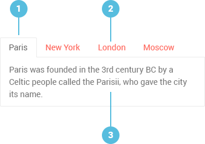

# Tabstrip Overview

The Kendo UI Tabstrip displays a collection of tabs with associated content, which allow the user to switch between different views inside a single component.

The Tabstrip is part of the [kendo-react-layout npm package](https://www.npmjs.com/package/@telerik/kendo-react-layout).

**Figure 1: A template of the Kendo UI Tabstrip**



1. Active tab
2. Inactive tab
3. Content area

## Demos

### Default Setup

```html-preview
  <div id="app"></div>
  <style>
      .sunny, .cloudy, .rainy {
          display: block;
          margin: 30px auto 10px;
          width: 128px;
          height: 128px;
          background: url('http://demos.kendoui.com/content/web/tabstrip/weather.png') transparent no-repeat 0 0;
      }

      .cloudy{
          background-position: -128px 0;
      }

      .rainy{
          background-position: -256px 0;
      }

      .weather {
          margin: 0 auto 30px;
          text-align: center;
      }

      #tabstrip h2 {
          font-weight: lighter;
          font-size: 5em;
          line-height: 1;
          padding: 0 0 0 30px;
          margin: 0;
      }

      #tabstrip h2 span {
          background: none;
          padding-left: 5px;
          font-size: .3em;
          vertical-align: top;
      }

      #tabstrip p {
          margin: 0;
          padding: 0;
      }
  </style>
```
```jsx
    const { Tab } = KendoReactLayout.Tabstrip;
    class TabstripContainer extends React.Component {
        constructor(props) {
            super(props);
            this.state = {
                selected: 0
            };
        }
        onSelect = (e) => {
            this.setState({
                selected: e.selected
            });
        };

        render() {
            return (
              <KendoReactLayout.Tabstrip onSelect={this.onSelect} selected={this.state.selected}>
                <Tab title="Paris">
                    <span className="rainy">&nbsp;</span>
                    <div className="weather">
                        <h2>17<span>&ordm;C</span></h2>
                        <p>Rainy weather in Paris.</p>
                    </div>
                </Tab>
                <Tab title="London">
                    <span className="sunny">&nbsp;</span>
                    <div className="weather">
                        <h2>21<span>&ordm;C</span></h2>
                        <p>Sunny weather in London.</p>
                    </div>
                </Tab>
                <Tab title="New York">
                    <span className="sunny">&nbsp;</span>
                    <div className="weather">
                        <h2>29<span>&ordm;C</span></h2>
                        <p>Sunny weather in New York.</p>
                    </div>
                </Tab>
                <Tab title="Moscow">
                    <span className="cloudy">&nbsp;</span>
                    <div className="weather">
                        <h2>16<span>&ordm;C</span></h2>
                        <p>Cloudy weather in Moscow.</p>
                    </div>
                </Tab>
              </KendoReactLayout.Tabstrip>);
        }
    }
    ReactDOM.render(
        <TabstripContainer />,
        document.getElementById('app')
    );
```

## Configuration

### Animation

By default, tabs are animated when the selection is changed. To disable it, set the [`animation`](#animation-boolean-default-true) property to `false`.

```html-preview
    <div id="app"></div>
```
```jsx
    const { Tab } = KendoReactLayout.Tabstrip;
    class TabstripContainer extends React.Component {
        constructor(props) {
            super(props);
            this.state = {
                selected: 0
            };
        }
        onSelect = (e) => {
            this.setState({
                selected: e.selected
            });
        };

        render() {
            return (
              <KendoReactLayout.Tabstrip onSelect={this.onSelect} selected={this.state.selected} animation={false}>
                <Tab title="First tab title">
                    First tab content
                </Tab>
                <Tab title="Second tab Title">
                    Second tab content
                </Tab>
              </KendoReactLayout.Tabstrip>);
        }
    }
    ReactDOM.render(
        <TabstripContainer />,
        document.getElementById('app')
    );

```

### Tabs

**Titles**

Each tab displays a title prompting the tab content, which is set through the [`title`](#title-string) attribute of the Tab.

```html-preview
    <div id="app"></div>
```
```jsx
    const { Tab } = KendoReactLayout.Tabstrip;
    class TabstripContainer extends React.Component {
        constructor(props) {
            super(props);
            this.state = {
                selected: 0
            };
        }
        onSelect = (e) => {
            this.setState({
                selected: e.selected
            });
        };

        render() {
            return (
              <KendoReactLayout.Tabstrip onSelect={this.onSelect} selected={this.state.selected}>
                <Tab title="First tab title">
                    First tab content
                </Tab>
                <Tab title="Second tab Title">
                    Second tab content
                </Tab>
              </KendoReactLayout.Tabstrip>);
        }
    }
    ReactDOM.render(
        <TabstripContainer />,
        document.getElementById('app')
    );

```

Apart from plain text, a tab title is also able to accommodate any React component.

**Position**

The tabs can render in different positions around the content by setting the [`tabPosition`](#tabPosition-string) attribute of the component.

```html-preview
    <div id="app"></div>
```
```jsx
    const { Tab } = KendoReactLayout.Tabstrip;
    class TabstripContainer extends React.Component {
        constructor(props) {
            super(props);
            this.state = {
                selected: 0
            };
        }
        onSelect = (e) => {
            this.setState({
                selected: e.selected
            });
        };

        render() {
            return (
              <KendoReactLayout.Tabstrip onSelect={this.onSelect} selected={this.state.selected} tabPosition="bottom">
                <Tab title="First tab title">
                    First tab content
                </Tab>
                <Tab title="Second tab Title">
                    Second tab content
                </Tab>
              </KendoReactLayout.Tabstrip>);
        }
    }
    ReactDOM.render(
        <TabstripContainer />,
        document.getElementById('app')
    );

```

**Initial Loading**

The Tabstrip displays the first tab upon its initial loading. To change this behavior, set the [`selected`](#selected-number-default-1) property. It is a zero-based value&mdash;to select the second tab, set it to `1`.

```html-preview
    <div id="app"></div>
```
```jsx
    const { Tab } = KendoReactLayout.Tabstrip;
    class TabstripContainer extends React.Component {
        constructor(props) {
            super(props);
            this.state = {
                selected: 1 //sets the tab that will be selected initially
            };
        }
        onSelect = (e) => {
            this.setState({
                selected: e.selected
            });
        };

        render() {
            return (
              <KendoReactLayout.Tabstrip onSelect={this.onSelect} selected={this.state.selected}>
                <Tab title="Tab1">
                    First tab content
                </Tab>
                <Tab title="Tab2">
                    Second tab content
                </Tab>
              </KendoReactLayout.Tabstrip>);
        }
    }
    ReactDOM.render(
        <TabstripContainer />,
        document.getElementById('app')
    );
```

**Disabling**

The Tabstrip allows for disabling specific tabs. To disable a tab, add the [`disabled`](#disabled) attribute.

```html-preview
    <div id="app"></div>
```
```jsx
    const { Tab } = KendoReactLayout.Tabstrip;
    class TabstripContainer extends React.Component {
        constructor(props) {
            super(props);
            this.state = {
                selected: 1
            };
        }
        onSelect = (e) => {
            this.setState({
                selected: e.selected
            });
        };

        render() {
            return (
              <KendoReactLayout.Tabstrip onSelect={this.onSelect} selected={this.state.selected}>
                <Tab title="Tab1" disabled>
                    First tab content
                </Tab>
                <Tab title="Tab2">
                    Second tab content
                </Tab>
              </KendoReactLayout.Tabstrip>);
        }
    }
    ReactDOM.render(
        <TabstripContainer />,
        document.getElementById('app')
    );
```

### Remote Content

To load remote content in the Tabstrip, nest a component that handles the remote data loading.

```html-preview
    <div id="app"></div>
```
```jsx
    const { Tab } = KendoReactLayout.Tabstrip;
    var RemoteContent = React.createClass({
      getInitialState: function() {
        return {
          content: {}
        };
      },

      componentDidMount: function() {
        let that = this;
        this.fetch().then(function(data) {
            that.setState({
                content: data
            })
        })
      },

      fetch: function () {
        return new Promise(function (resolve, reject) {
          // simulate an asynchronous action where data is fetched on
          // a remote server somewhere.
          setTimeout(function () {
            // resolve with some mock data
            resolve({
                Wheelbase :"2851 mm"
            });
          }, 500);
        });
      },

      render: function() {
        return (
          <dl className="specification">
              <dt>Wheelbase</dt>
              <dd>{this.state.content.Wheelbase}</dd>
          </dl>
        );
      }
    });

    var Tabstrip = React.createClass({
          getInitialState: function() {
              return { selected : 0 }
          },
          onSelect: function(e) {
              this.setState({
                  selected: e.selected
              })
          },
          render: function() {
            return (
                <KendoReactLayout.Tabstrip onSelect={this.onSelect} selected={this.state.selected}>
                    <Tab title="Dimensions &amp; Weights">
                        <RemoteContent />
                    </Tab>
                    <Tab title="Engine">
                        Engine specification here.
                    </Tab>
                </KendoReactLayout.Tabstrip>
            )}
    });
    ReactDOM.render(
        <Tabstrip />,
        document.getElementById('app')
    )
```

### Events

The Tabstrip is stateless. To store its state and configuration properties, wrap it in a high-order component.

The [`onSelect`](#onselect-function) event fires each time a user interacts with the Tabstrip. The newly selected tab index is passed as an argument to the `onSelect` callback.

```html-preview
    <div id="app"></div>
    <span id="log"></span>
```
```jsx
    const { Tab } = KendoReactLayout.Tabstrip;
    let count = 0;
    class TabstripContainer extends React.Component {
        constructor(props) {
            super(props);
            this.state = {
                selected: 0
            };
        }
        onSelect = (e) => {
            this.setState({
                selected: e.selected // the callback will be called when selection is made
            });
            count ++;
            document.getElementById('log').innerText = count + " times the onSelect was called";
        };

        render() {
            return (
              <KendoReactLayout.Tabstrip onSelect={this.onSelect} selected={this.state.selected}>
                <Tab title="Tab1">
                    First tab content
                </Tab>
                <Tab title="Tab2">
                    Second tab content
                </Tab>
              </KendoReactLayout.Tabstrip>);
        }
    }
    ReactDOM.render(
        <TabstripContainer />,
        document.getElementById('app')
    );
```

For detailed information refer to the [API documentation]().

## Keyboard Navigation

Below is the list with the keyboard shortcuts the Tabstrip supports.

| SHORTCUT                            | DESCRIPTION         |
|:---                                 |:---                 |
| `Upper Arrow` & `Left Arrow` keys   | Select the previous tab. |
| `Down Arrow` & `Right Arrow` keys   | Select the next tab.     |
| `Home`                              | Select the first tab.    |
| `End`                               | Select the last tab.     |

## Routing

The Tabstrip can easily be integrated with the [react-router](https://github.com/reactjs/react-router). Here is a [possible implementation](https://github.com/telerik/kendo-react-layout/blob/master/examples/tabstrip_routing.jsx).

## Accessibility

The Tabstrip is WAI ARIA-accessible through the `Tab` key. The `aria-expanded` attribute is set on the currently displayed content of a tab. The `tabindex` attribute will be set to `0` (zero) on the active tab and `-1` for the inactive tabs.

## Suggested Links

* [API Reference of the Tabstrip](https://github.com/telerik/kendo-react-layout/blob/master/docs/tabstrip/api.md)
